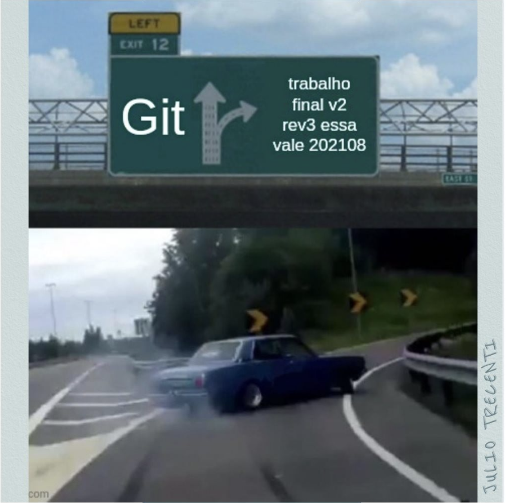
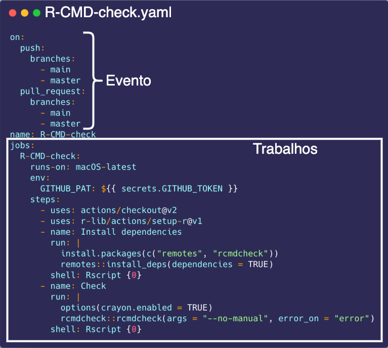
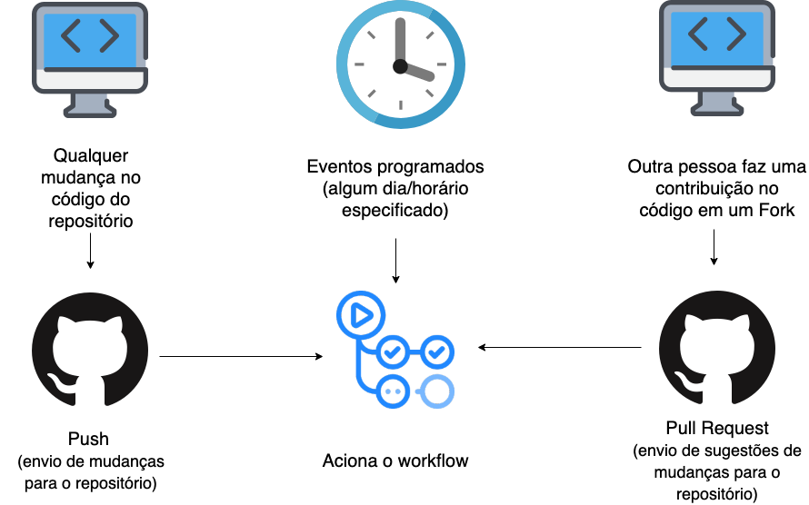
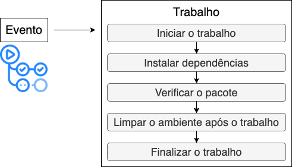

```{r setup, include=FALSE}
`%>%` <- magrittr::`%>%`

colorido <- function(x, cor = "#6495ed") {
  glue::glue(
    '<span style="color:{cor}; font-weight: bold;">{x}</span>'
  ) %>% 
    htmltools::HTML()
}

options(width = 85)

knitr::opts_chunk$set(eval = TRUE, echo = TRUE, comment = "#>", fig.align = "center")
```

.pull-left[
## <a href='https://linktr.ee/j.trecenti'> Julio Trecenti 📌</a>

```{r, echo=FALSE, out.width="30%", fig.align='center'}
knitr::include_graphics("img/jtrecenti.png")
```


Doutorando em Estatística pelo IME-USP. Diretor da Associação Brasileira de Jurimetria (ABJ). Professor auxiliar no Insper. Professor na [Curso-R](https://curso-r.com/). 

Trabalha com web scraping, arrumação de dados, modelos preditivos, APIs, pacotes em R e dashboards em Shiny.

]

.pull-right[
## <a href='https://linktr.ee/beamilz'> Beatriz Milz    📌</a>

```{r, echo=FALSE, out.width="30%", fig.align='center'}
knitr::include_graphics("img/bea.jpg")
```

Doutoranda em Ciência Ambiental (PROCAM/IEE/USP) na Universidade de São Paulo. 

Co-organizadora da [R-Ladies São Paulo](https://www.meetup.com/R-Ladies-Sao-Paulo/). Instrutora de tidyverse [certificada pela RStudio](https://education.rstudio.com/trainers/people/milz+beatriz/).
Professora na [Curso-R](https://curso-r.com/).

]

---
name: sumario

## Temas que falaremos hoje

- [Pré-requisitos](#pre-requisitos)

- [Estrutura básica de um pacote em R](#basico-pacotes)

- [Revisão sobre Git e GitHub](#revisao-github)

- [O que é integração contínua e GitHub Actions?](#gha)

- [Exemplos usando GitHub Actions para:](#exemplos)

  - [Executar a checagem de um pacote em R](#exemplo-check)
  - [Automatizar uma tarefa](#exemplo-automacao) 

- [Referências](#referencias)

---
class: middle

## GitHub Actions

> ### ... nos ajuda a **automatizar tarefas**. ([fonte](https://docs.github.com/pt/actions/learn-github-actions/introduction-to-github-actions))

--

#### É a coisa mais útil/interessante que eu (Bea) aprendi nos últimos meses 🚀

--

#### Desde que aprendi eu (Julio) uso em quase todos os projetos 🤖

---


.pull-left[

## Conhecimentos úteis

#### Git e GitHub <i class="fab fa-github"></i>

#### Pacotes em R 📦

#### Testes unitários <i class="fas fa-mitten"></i> *
.footnote[*(caso queira executar os testes, e fazer a avaliação da cobertura)]

- [Nos slides finais](#referencias), tem referências de cada um destes assuntos! 📚

]

--

.pull-right[
## Alinhamentos:

- Atividade expositiva

- [Material do curso de Pacotes](https://curso-r.github.io/main-pacotes/slides/index.html) da [Curso-R](https://curso-r.com/)


- [Material sobre como usar Git e GitHub no RStudio](https://beatrizmilz.com/talk/2021-git-e-github-gyn/)
]


---
name: pre-requisitos

## Pré-requisitos para criar pacotes


- [R](https://livro.curso-r.com/1-1-instalacao-do-r.html) e [RStudio](https://livro.curso-r.com/1-1-instalacao-do-r.html) instalados

- [Ferramentas de desenvolvimento](https://r-pkgs.org/setup.html#setup-tools):

  - Windows: [RTools instalado](https://livro.curso-r.com/1-3-instalacao-adicionais.html#rtools)
  
  - Linux: [r-base-dev](https://livro.curso-r.com/1-3-instalacao-adicionais.html#rtools)
  
  - MacOS: Xcode command line tools

```{r}
devtools::has_devel()
```

---
## Pré-requisitos

- [Pacotes necessários instalados](https://github.com/curso-r/main-pacotes#pacotes-necess%C3%A1rios)


```{r eval=FALSE, include=TRUE}
pacotes <- c(
  "devtools",
  "usethis",
  "knitr"
) 

install.packages(pacotes)

```


- [Git instalado](https://git-scm.com/)

- [Conta no GitHub criada](https://github.com/)

---
name: basico-pacotes
class: middle, center, inverse

## Estrutura básica de um pacote em R


---
## Pacotes

Um pacote do R é uma forma específica de organizar seus código, seguindo o protocolo descrito pela R Foundation:

> _Pacotes são a unidade fundamental de código R reprodutível._
> 
> — Wickham & Bryan

.pull-left[
- Pacotes incluem: 
  - Funções em R
  - Documentação sobre como usá-las
  - Testes
  - Dados de exemplo
]

.pull-right[
```{r echo=FALSE, fig.align='center'}

```
]

---
class: middle, center

## A ferramenta da produtividade: usethis

```{r echo=FALSE, out.width="70%"}
knitr::include_graphics("https://raw.githubusercontent.com/allisonhorst/stats-illustrations/master/rstats-artwork/usethis.png")
```

---
## Criando um pacote

Para criar um pacote, usamos a função `usethis::create_package()`

- Você deve passar um caminho como `~/Documents/meupacote` e uma nova pasta chamada `meupacote` será criada dentro da pasta `Documents`. Essa pasta será tanto um `Rproj` quanto um pacote, ambos chamados `meupacote`

> - **Dica geral:** não adicione acentos, caracteres especiais e espaços no nome dos caminhos, arquivos, funções, pacotes, etc.

```{r eval=FALSE}
usethis::create_package("~/Documents/meupacote")
```


---
## Estrutura básica do pacote

Essa é a estrutura criada quando usamos a função `usethis::create_package()`:

- `meupacote.Rproj`: este arquivo faz com que este diretório seja um projeto no RStudio (RStudio Project)


- `DESCRIPTION`: define o nome, descrição, versão, licença, dependências e outras caracaterísticas do seu pacote

- `R/`: aqui ficam as funções desenvolvidas em R

- `.Rbuildignore`:  Lista arquivos que não devem ser incluídos ao compilar o pacote R a partir do código-fonte
<!-- usethis::use_build_ignore("..") ajuda a adicionar arquivos no .Rbuildignore-->

- `NAMESPACE`: Não devemos editar este arquivo manualmente. Ele declara as funções que o pacote exporta para uso externo e as funções externas que seu pacote importa de outros pacotes

---
## A pasta R/

Dentro de um pacote, a pasta `R/` só pode ter arquivos R com funções.

- Uma função é responsável por executar uma tarefa pequena, mas muito bem. Quando trabalhamos com funções, nossas operações ficam mais confiáveis.

- A ideia da pasta `R/` é guardar em um local comum tudo aquilo que nós utilizamos como ferramenta interna para nossas análises, bem como aquilo que queremos que outras pessoas possam usar no futuro.

- Podemos usar `usethis::use_r("nome-do-arquivo")` para que um arquivo seja criado antes começarmos a escrever uma função.

- Assim que escrevermos/modificarmos alguma função, podemos carregá-las com `devtools::load_all()` e executá-las manualmente

---
## Dependências

Quando lidamos com pacotes, a função `library()` não pode ser utilizada, e todas as funções devem ter seus pacotes de origem explicitamente referenciados pelo operador `::`.

- `usethis::use_package()`: adiciona pacotes que foram instalados via CRAN
  
- `usethis::use_dev_package()`: adiciona pacotes que não foram instalados via CRAN
  
- `usethis::use_pipe()`: use quando você usa o pipe do magrittr.

- Para escrever `dplyr::`, por exemplo, basta digitar `d`, `p`, `l` e apertar TAB uma vez. Com os `::`, as sugestões passarão a ser somente de funções daquele pacote.


---

## Etapas iniciais

- Criar um pacote usando a função `usethis::create_package("~/caminho/ate/o/nomepacote")`

- No arquivo DESCRIPTION, adicionar o nome de quem criou o pacote, além do título e descrição do pacote.

- Adicionar uma licença com `usethis::use_**_licence()`

- Versionar o projeto usando `usethis::use_git()`

- Crie um repositório no GitHub onde esse pacote será versionado utilizando `usethis::use_github()`

- Crie uma função com `usethis::use_r("nome-funcao")`

---

## Funções para repetir com frequência


- `devtools::document()`: atualiza a documentação e o arquivo NAMESPACE

- `devtools::load_all()`: carrega as funções do pacote, que ficam disponíveis para uso

- `devtools::check()`: verifica se o pacote está funcionando. Ela carrega todo o código, gera toda a documentação e executa todos os testes, verificando em todo passo se tudo está funcionando como o esperado. Pode apresentar erros, avisos e notas. Leia as mensagens no console :) 

---

# Vamos criar um pacote no R!

```{r, echo=FALSE}
knitr::include_graphics("img/cat.gif")
```


---
name: revisao-github
class: inverse, middle, center

## Revisão sobre Git e GitHub

```{r echo=FALSE, out.width="40%", fig.cap="Fonte: <a href='https://www.instagram.com/p/CTxBAC0rv3Z/'>Faxineiro de Dados</a>"}

```

---

## O que é Git?

- Git é um **sistema de versionamento**,  que é capaz de guardar o histórico de alterações de todos os arquivos dentro de uma pasta, que chamamos de repositório.


- Torna-se importante à medida que seu trabalho é __colaborativo__.

- Git é um software que você instala no computador.


```{r echo=FALSE, out.width="30%"}
knitr::include_graphics("https://git-scm.com/images/logo@2x.png")
```

---

## O que é GitHub?


- GitHub é um site para compartilhar repositórios Git.

- Utilizado por milhões de pessoas em projetos de código aberto ou fechado.

- Útil para colaborar com outras pessoas programadoras em projetos de ciência de dados.

- Existem alternativas, como [GitLab](https://about.gitlab.com/) e [BitBucket](https://bitbucket.org/product).

- GitHub é um site que você acessa na internet.

- [GitHub percente à Microsoft desde 2018](https://g1.globo.com/economia/tecnologia/noticia/microsoft-compra-github-por-us-75-bilhoes.ghtml).

```{r echo=FALSE, out.width="30%"}
knitr::include_graphics("img/github.png")
```

---

## Usando Git e GitHub 

- [Saiba como configurar o GitHub no RStudio nessa apresentação](https://beatrizmilz.com/talk/2021-git-e-github-gyn/)

- O pacote [`usethis`](https://usethis.r-lib.org/) apresenta várias funções úteis.

- Cada pacote deve estar vinculado à um projeto no RStudio `.RProj`, e também a um repositório no GitHub.

- Lembre-se das funções:

```{r eval=FALSE, include=TRUE}
usethis::use_git() # para iniciar o versionamento do projeto com Git 
# (a partir deste momento podemos chamar de repositório!)

usethis::use_github() # para vincular esse repositório com o GitHub
```

---

# Vamos colocar nosso pacote no GitHub!

```{r, echo=FALSE}
knitr::include_graphics("img/cat.gif")
```

---
name: gha
class: middle, center, inverse
## O que é integração contínua e GitHub Actions?

---
## Integração contínua

- Dado um certo código e um método consistente de testá-lo, faz todo sentido
**automatizar** o processo

- Integração contínua normalmente envolve garantir que a versão mais
recente do software está atendendo os padrões de qualidade.
    
- Serve para responder perguntas do tipo:
  - O seu código funciona em máquinas diferentes?
  - Uma mudança no código quebrou alguma coisa?

- Existem algumas alternativas, como [Circle](https://circleci.com), [Travis](https://travis-ci.org) e [AppVeyor](https://appveyor.com). 

- Hoje vamos falar sobre o **GitHub Actions** porque ele se conecta facilmente
com o GitHub

---
## Integração contínua

.pull-left[

- Vários pacotes usam para fazer executar o check e testes: [{readr}](https://github.com/tidyverse/readr/tree/master/.github/workflows), [{dplyr}](https://github.com/tidyverse/dplyr/tree/master/.github/workflows), [{usethis}](https://github.com/r-lib/usethis/tree/master/.github/workflows), e muitos outros

- Pacote [{mananciais}](https://beatrizmilz.github.io/mananciais/) - atualiza diariamente a base de dados 

- Página [Materiais sobre R](https://materiais-estudo-r.netlify.app/) - atualiza o site sempre que há mudança na base de dados

- Os pacotes mais bem feitos da Curso-R também utilizam: [{chess}](https://github.com/curso-r/chess) e [{stockfish}](https://github.com/curso-r/stockfish)

]

.pull-right[

<br><br>

```{r echo=FALSE, fig.align='center'}
knitr::include_graphics("https://avatars.githubusercontent.com/u/44036562?s=200&v=4")
```

]

---
## GitHub Actions

> GitHub Actions ajuda a automatizar tarefas dentro de seu ciclo de vida de
desenvolvimento de software https://docs.github.com/pt/actions

- Um **workflow** é processo bem-definido que será executado no
repositório ao qual ele pertence

- Ele é definido a partir de um arquivo YAML dentro da pasta `.github/workflows`

  - É comum definir workflows para testagem de pacotes, geração de documentação, 
  atualização de dados, etc.
  
- O workflow é, essencialmente, um duende mágico que baixa o nosso repositório
em um **servidor do GitHub** e executa os comandos especificados

  - O plano gratuito já funciona para bastante coisa, mas cuidado com os
  **custos** das máquinas MacOS

---

## Fluxos de trabalho (workflows)

<!-- - Os arquivos .yaml que armazenam informações os fluxos de trabalho, onde estão descritos os eventos e trabalhos. -->

```{r echo=FALSE, fig.align='center', out.width="45%"}

```

Diagrama feito utilizando o site [draw.io](https://draw.io)  e [Carbon](https://carbon.now.sh/). Código de [r-lib/actions](https://github.com/r-lib/actions/tree/master/examples#quickstart-ci-workflow).

???

Os arquivos .yaml armazenam informações os fluxos de trabalho, onde estão descritos os eventos e trabalhos. 

---
## Integração contínua com GitHub Actions

Para utilizar o GitHub Actions, usamos arquivos `.yaml` que armazenam informações os fluxos de trabalho.

- **Eventos**: Um evento é uma atividade que aciona um fluxo de trabalho. Por exemplo:
  
  - Quando o repositório recebe uma alteração (`on: push`)
  
  - Quando um Pull Request é criado (em outras palavras, alguém está enviando uma contribuição para o repositório) (`on: pull_request`)
  
  - Eventos programados. Ex: a cada hora, todos os dias, uma vez por semana, uma vez por mês, etc. O site [CronTab](https://crontab.guru/) é muito útil para isso.
  
---

## Eventos: Um evento é uma atividade que aciona um fluxo de trabalho. 

```{r echo=FALSE, fig.align='center', out.width="55%"}

```

Diagrama feito utilizando o site [draw.io](https://draw.io).
  
---
## Integração contínua com GitHub Actions

- **Trabalho**: Um evento aciona automaticamente o fluxo de trabalho, que contém um trabalho. Em seguida, o trabalho usa etapas para controlar a ordem em que as ações são executadas. Exemplo de ações executadas:
  
  - Executar testes
  
  - Executar um script `.R`
      - Atualizar um relatório `.Rmd`
      - Checar um pacote
      - Entre outros

---

## Trabalho: O trabalho usa etapas para controlar a ordem em que as ações são executadas

```{r echo=FALSE, fig.align='center', out.width="60%"}

```

Diagrama feito utilizando o site [draw.io](https://draw.io).

---
## Integração contínua com GitHub Actions (cont.)

- Recomendação: partir de um arquivo de workflow já existente, e alterar o que for necessário. 

  - [Neste repositório](https://github.com/r-lib/actions/tree/master/examples#readme), estão disponíveis alguns exemplos de workflows de GitHub Actions que podemos usar com pacotes em R

- Os arquivos `.yaml` devem estar em um diretório específico do pacote:  `pacote/.github/workflows/nome-do-workflow.yaml`

- O pacote {usethis} também pode nos ajudar nisso, com a função `usethis::use_github_action()`. 

---
name: exemplos
class: inverse, middle, center

# Exemplos

---
name: exemplo-check

## Executar a checagem de um pacote em R 

- O pacote {usethis} pode nos ajudar nisso. A função abaixo irá configurar utilizando o código disponível no  [r-lib/actions](https://github.com/r-lib/actions/tree/master/examples#example-workflows), usado para fazer uma checagem simples no pacote:

```{r eval=FALSE}
usethis::use_github_action("check-release")
```

- Evento: 
  - Sempre que houver um novo push no repositório

- Trabalho:
  - Similar ao `devtools::check()`: vai verificar o pacote e também executar todos os testes.  

---
name: exemplo-automacao

## Automatizar uma tarefa

- Podemos copiar de exemplos que já existem.

- Vamos criar uma tarefa que roda a cada 5 minutos.

- Não quer esperar os pacotes instalarem toda vez? Vamos usar [`{renv}`](https://rstudio.github.io/renv/articles/renv.html)!

---
name: referencias

## Referências  e materiais para estudo

- [Material do curso de Pacotes](https://curso-r.github.io/main-pacotes/slides/index.html), da [Curso-R](https://curso-r.com/)


- [Material sobre como usar Git e GitHub no RStudio](https://beatrizmilz.com/talk/2021-git-e-github-gyn/)

- [Zen do R](https://curso-r.github.io/zen-do-r/), livro em desenvolvimento pela Curso-R.

- [R Packages](https://r-pkgs.org), livro aprofundado sobre desenvolvimento de pacotes.

- [Documentação do GitHub Actions](https://docs.github.com/pt/actions/learn-github-actions/introduction-to-github-actions)
  
- [Exemplos de workflows no repositório r-lib/actions](https://github.com/r-lib/actions/tree/master/examples#example-workflows)

---
class: center

## Agradecemos a atenção!

.pull-left[
```{r echo=FALSE, fig.align='center', out.width="100%"}
knitr::include_graphics("https://media.giphy.com/media/M9NbzZjAcxq9jS9LZJ/giphy.gif")
```

]

.pull-right[

Lembre-se de enviar as dúvidas no [discourse da Curso-R](https://discourse.curso-r.com/)!

Slides criados usando os pacotes em R  📦 :

[**xaringan**](https://github.com/yihui/xaringan)<br>
[gadenbuie/xaringanthemer](https://github.com/gadenbuie/xaringanthemer)

O chakra vem da biblioteca javascript [remark.js](https://remarkjs.com), e os pacotes  [**knitr**](http://yihui.name/knitr), e [R Markdown](https://rmarkdown.rstudio.com).


]
 
<!-- inicio font awesome -->
<script src="https://kit.fontawesome.com/1f72d6921a.js" crossorigin="anonymous"></script>

<!-- final font awesome -->

